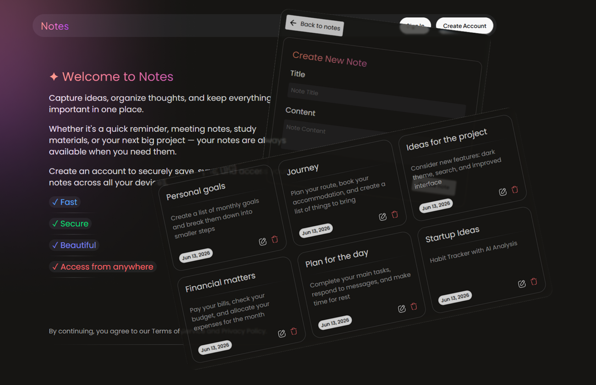

# 📝 Notes App (MERN Stack)

Полноценное приложение для создания и управления заметками, построенное на современном стеке MERN (MongoDB, Express, React, Node.js).


## 🚀 Функционал

- 🔐 Аутентификация пользователей (JWT Bearer токены)
- 👤 Регистрация и логин
- 🗂️ Создание, редактирование и удаление заметок
- 🔍 Получение данных через оптимизированные запросы
- ⚡ Работа с серверным API на Node.js + Express
- 📦 Хранение данных в MongoDB
- 🧠 Управление серверным состоянием через TanStack Query
- 🎯 Защищённые маршруты (Protected Routes)


## 🛠️ Технологии

- 🌐 Frontend: React + TanStack Query
- 🧩 Backend: Node.js + Express
- 🍃 Database: MongoDB + Mongoose
- 🔑 Auth: JWT (Bearer Token)
- 🎨 REST API архитектура


## 📌 Особенности

- Быстрая синхронизация данных без лишних запросов
- Безопасная JWT-аутентификация
- Чистая архитектура client/server
- Масштабируемая структура проекта


## 💡 Цель проекта

Этот проект создан для практики:

- работы с fullstack разработкой
- построения auth системы на JWT
- управления серверным состоянием через TanStack Query
- проектирования REST API

## 🌐 Онлайн-версия

🚀 Приложение развернуто на Vercel и доступно по ссылке:

🔗 [Открыть приложение](https://mern-notes-frontend-eta.vercel.app)

💡 Зарегистрируйтесь или войдите в аккаунт, чтобы создавать, редактировать и удалять заметки в удобном интерфейсе.

## 📦 Установка и запуск

### 📥 Клонирование репозитория

```bash
git clone <https://github.com/ruslansalyukov/mern-notes.git>
cd project

🚀 Запуск Backend

cd backend
npm install
npm run dev

🎨 Запуск Frontend

cd frontend
npm install
npm run dev